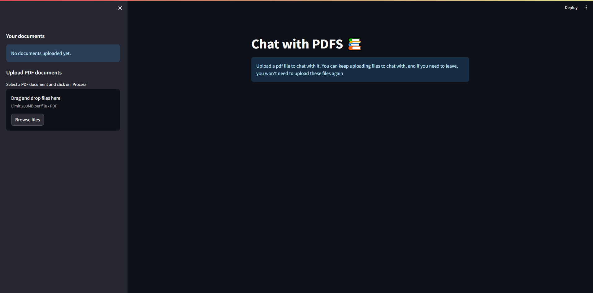
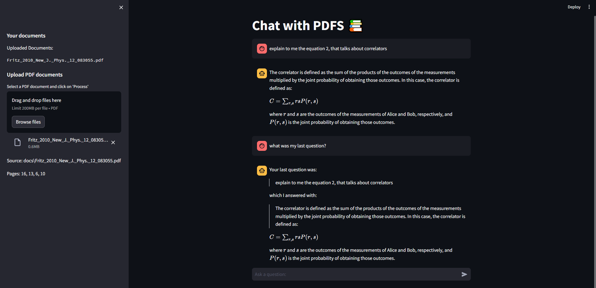
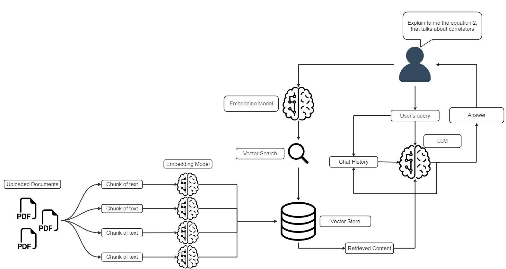

# RAG-ChatBot: Retrieval Augmented Generation Chatbot

A **Retrieval Augmented Generation (RAG) ChatBot** that lets you chat with multiple PDF documents using Google's Gemini-Pro model, Langchain, ChromaDB, and Streamlit. Ask questions in natural language and get accurate, document-based answers. The model only responds to questions about the uploaded documents.

---

## Features

- **Upload Documents:** Instantly upload PDFs and chat with them—no need to reload the app.
- **Persistent Storage:** Previously uploaded documents are available on restart; keep adding more to chat with all at once.
- **Simple UI:** Minimal interface with just an "Upload" button; everything else is automated.
- **Chat History:** Remembers up to 10 previous user/model exchanges for context-aware conversations.
- **Source Attribution:** Each answer includes a source reference in the sidebar for transparency.

---

## Screenshots

**First Launch (No Documents):**



**In Use (With Documents):**



---

## How It Works



1. **Upload PDF:**
   - On first launch, upload a PDF. The app creates a `docs` folder if needed and saves PDFs there.
2. **Text Chunking:**
   - Extracts text from PDFs and splits it into manageable chunks based on the embedding model's token limit.
3. **Embedding & Storage:**
   - Chunks are embedded into vectors and stored in a ChromaDB vector database (`Vector_DB - Documents`).
4. **Similarity Matching:**
   - User questions are embedded and compared to document chunks using cosine similarity to find the most relevant content.
5. **Response Generation:**
   - Relevant chunks, the question, and chat history are sent to Gemini-Pro, which generates a context-aware answer. The answer and question are added to the chat history.

> **Note:** If documents are already processed, steps 1–3 are skipped on startup. Uploading new PDFs triggers only the necessary processing.

---

## Getting Started

### Prerequisites
- **Python** (make sure it's installed)
- **Google API Key** (for Gemini-Pro)

### 1. Get a Google API Key
- Visit [Google AI Studio](https://aistudio.google.com/app/apikey).
- Accept terms, create a new API key, and copy it for later use.

### 2. Clone or Download the Repository
- Download as ZIP and extract, or clone the repo.
- Navigate to the folder containing `README.md` and `requirements.txt`.

### 3. Create a `.env` File
- In the project root, create a file named `.env` (no filename, just `.env`).
- Add your API key in this format:

  ```env
  GOOGLE_API_KEY="your_api_key_here"
  ```

  Example:
  ```env
  GOOGLE_API_KEY="AIzaSyCJOZtTkyN9rfuXEjTtngeubYTUne"
  ```

- Save the file. It should appear alongside `README.md` and `requirements.txt`.

### 4. Install Dependencies
- Open a terminal in the project folder.
- Run:

  ```shell
  pip install -r requirements.txt
  ```

### 5. Run the App
- In the same terminal, start the app:

  ```shell
  streamlit run app/app.py
  ```

- A browser window will open with the app ready to use.
- To stop the app, press `Ctrl+C` in the terminal.

---

## File Structure

```
├── app/
│   ├── app.py
│   ├── docs/
│   ├── utils/
│   └── Vector_DB - Documents/
├── requirements.txt
├── README.md
├── .env
└── ...
```

---

## Environment Variables

- `GOOGLE_API_KEY` — Your Google Gemini-Pro API key (required)

---

## Troubleshooting

- **No API Key:** Make sure `.env` exists and contains your API key.
- **Dependencies:** Ensure all packages are installed with `pip install -r requirements.txt`.
- **PDF Not Detected:** Confirm your PDF is in the correct format and not corrupted.

---

## License

This project is for educational and research purposes only.

---

## Credits

- [Google Gemini-Pro](https://aistudio.google.com/)
- [Langchain](https://python.langchain.com/)
- [ChromaDB](https://www.trychroma.com/)
- [Streamlit](https://streamlit.io/)

---

Enjoy chatting with your documents!
